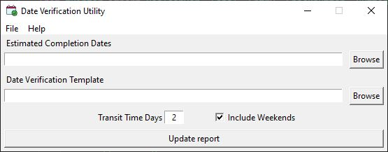

# Supply Line Utility

## About

This utility automates updates to the Promise Date Verification using estimated completion dates provided by a scheduler. When updates cannot be made automatically or for exceptions, the user is notified which lines need manual review.

Optionally and email can be generated to return the Promise Date Verification to a user-configurable list of contacts.

## Installation
Download and run the latest release.

## Instructions for Use

TODO

## Issues or Feature Requests
Please submit issues [here](https://github.com/paulrunco/date-verification/issues) or email the author directly.